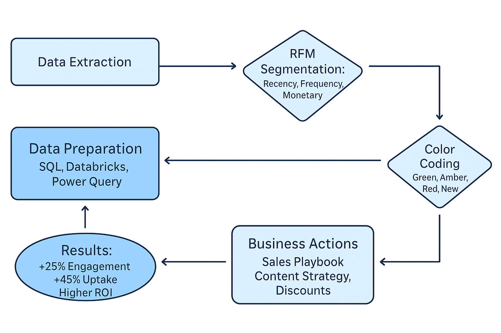

# 💉 Vaxikart — Camapign Analysis & Customer Segmentation Dashboard

## 📖 Overview
Vaxikart is a digital application that allows healthcare professionals (HCPs) to **order vaccines** directly from authorized providers.  
The objective of this project was to build a data-driven strategy to optimize customer engagement and improve vaccine uptake by applying advanced **RFM segmentation, behavioral analytics, and ROI measurement of digital campaigns**.

## ❓ Problem Statement
The existing customer management approach used a **randomized engagement strategy**, treating all HCPs the same.  
- No **customization** in outreach.  
- No **return-on-investment (ROI) analysis** of campaigns.  
- Limited ability for sales teams to make **data-backed decisions** during client meetings.  

## ⚙️ Actions
1. **Data Analysis & Segmentation**
   - Performed **RFM analysis** (Recency, Frequency, Monetary value) for each of the **7 vaccine brands**.  
   - Segmented customers into:  
     - **Lost** — inactive or low-purchase clients.  
     - **Fence-sitters** — irregular or moderate purchase clients.  
     - **Loyalists** — consistent and high-value clients.  

2. **Color-Coded Trend Classification**
   - Based on **previous month’s purchase pattern**, customers were coded as:  
     - 🟥 **Red** → declining engagement.  
     - 🟨 **Amber** → stable but low growth.  
     - 🟩 **Green** → increasing uptake.  
     - 🔵 **New** → first-time buyers.  

3. **Campaign ROI Analysis**
   - Evaluated the **return on investment for each digital campaign**.  
   - Aligned campaign **engagement metrics (clicks, opens, conversions)** to HCP purchase patterns.  
   - Identified **which campaigns generated measurable uptake** at the customer level, enabling smarter budget allocation.  

4. **Sales & Marketing Strategy**
   - Created a **personalized playbook** for sales teams to use in HCP meetings.  
   - Designed **content strategies** tailored to the RFM segments.  
   - Automated **promotional messages & discounts** based on customer color codes.  

## 🔄 Project Workflow

## 📈 Results
- Provided the sales team with **customized strategies per customer** instead of randomized outreach.  
- **Content strategy** aligned to RFM segments improved **HCP engagement by 25%**.  
- **Promotional campaigns** tied to Red/Amber/Green segmentation increased vaccine uptake by **45%**.  
- **ROI analysis** ensured that marketing spend was targeted toward **high-return campaigns**, maximizing efficiency.  
- Enabled clear, actionable **insights for sales meetings**, driving measurable business ROI.  

## 📌 Business Impact
| Impact Area            | Value Delivered |
|-------------------------|-----------------|
| **Sales Efficiency**    | Sales teams received customer-specific insights, saving time and improving meeting outcomes. |
| **Customer Engagement** | RFM-based targeting improved content relevancy, boosting HCP engagement by 25%. |
| **Revenue Growth**      | Discount and promotional strategies increased overall vaccine uptake by 45%. |
| **Marketing ROI**       | Campaign ROI analysis aligned marketing investments with purchase patterns, maximizing returns. |
| **Decision Support**    | Created a data-driven framework for ongoing monitoring and strategy refinement. |

## 🛠 Skills & Tools
- **SQL** — Data extraction and transformation from ETL pipelines.  
- **Databricks (PySpark, SQL)** — Data manipulation, wrangling, and feature engineering.  
- **Python** — RFM analysis, customer segmentation, and ROI modeling.  
- **Power BI** — Interactive dashboards for sales teams.  
- **Power Query** — Data cleaning, shaping, and transformation for BI reporting.  

## 📝 Takeaways
- **Segmentation works**: Even simple RFM models provided clear direction for sales strategy.  
- **Behavioral trends matter**: Color-coded month-on-month changes allowed proactive intervention.  
- **Campaign ROI is critical**: Measuring campaign returns at the HCP level ensured better allocation of marketing spend.  
- **Scalable approach**: Methodology can be extended to new brands or product lines.  

## 🚀 Next Steps
- Integrate **real-time dashboards** (Power BI / Streamlit) for live monitoring.  
- Add **predictive modeling** to anticipate churn and growth opportunities.  
- Expand segmentation framework to include **demographics and regional trends**.  
